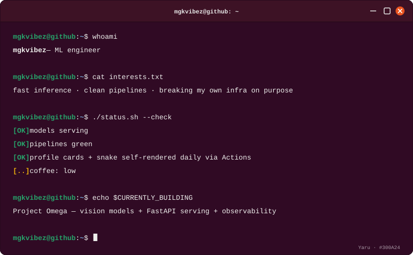
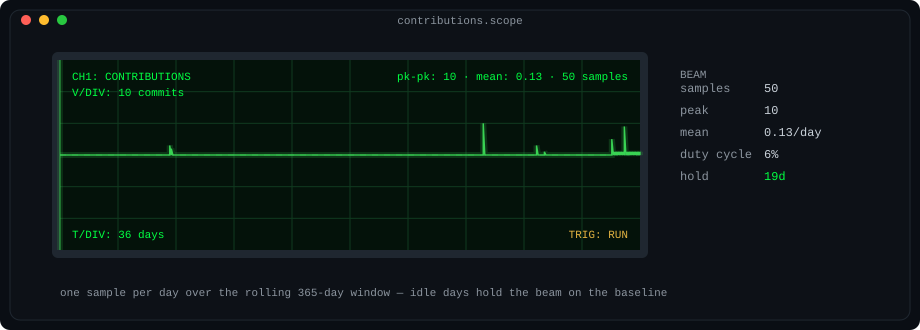
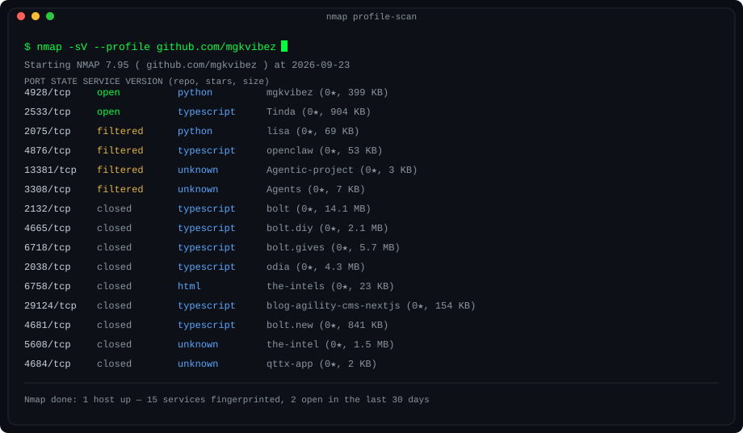
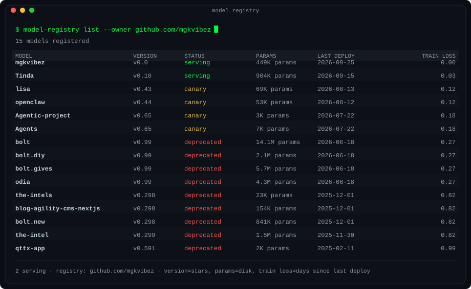
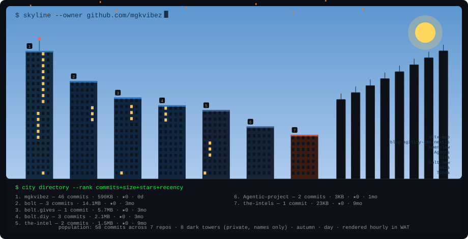

---

  

## About me

I'm a machine learning engineer focused on shipping models that actually survive production: fast inference, clean data pipelines, and infrastructure that's been stress-tested rather than just deployed and hoped for.

- 🔭 **Currently building:** Project Omega — lightweight vision models with FastAPI serving and full observability
- 🌱 **Currently deepening:** Linux internals, container hardening, and offensive-security tooling (so I can find the holes before someone else does)
- 🧩 **Core stack:** PyTorch, FastAPI, Docker, Kubernetes, Linux
- 💬 **Ask me about:** model serving, ML infra, or reproducible training pipelines

---

## Tech stack

  
  
  
  
  
  
  
  
  
  

---

## Self-rendered cards

No third-party widget APIs in this section — these four cards are drawn by my own generator (`cards/`), rendered from the live GitHub GraphQL API and committed straight back to this branch daily by [`.github/workflows/cards.yml`](.github/workflows/cards.yml), the same pattern as the snake.

### Training log

  

_Loss is the share of the year's contributions still owed at each week of the run — the curve converges only when I ship. The marker heartbeats while status reads "converging"._

  

_One sample per day; idle days hold the beam on the baseline. The sweep line scans every seven seconds._

The contribution year as a training run: loss is the share of the year's work still owed, and it converges only when I ship. The scope on the right samples one day at a time — idle days hold the beam on the baseline.

### Recon

  

_Every repo is a service on host `github.com/mgkvibez` — open if pushed in the last 30 days, filtered within 90, closed beyond that. Ports are stable hashes of the repo name._

  

_Repos as models in a registry: version = stars, params = disk footprint, train loss = days since the last deploy. Loss drifts up while a repo sits idle._

Every repo is a service on host `github.com/mgkvibez` — open if pushed in the last 30 days, filtered within 90, closed beyond that. The registry frames them as models: version = stars, params = disk footprint, train loss = days since the last deploy.

---

## GitHub analytics

  
  

  

> Stats are rendered live by [github-readme-stats](https://github.com/anuraghazra/github-readme-stats) — no local generation or workflow needed, so they're always current.

  

---

## Contribution activity

<picture>
  <source media="(prefers-color-scheme: dark)" srcset="assets/images/github-contribution-grid-snake-dark.svg" />
  <source media="(prefers-color-scheme: light)" srcset="assets/images/github-contribution-grid-snake.svg" />
  
</picture>

<i>Auto-generated daily by <a href=".github/workflows/snake.yml">.github/workflows/snake.yml</a>. The snake starts electric blue and turns terminal green as it eats through the year — keyframe colours interpolated over its run, repainted after every regeneration.</i>

### Contribution city

  

<i>Every repo is a skyscraper: height ranks commits (with codebase size and stars as tie-breakers), window lights track how recently it was pushed, the facade is tinted by its primary language, and the tallest tower wears the blinking beacon. The sky keeps real West African Time — sun by day, moon and stars by night, windows dimming at dawn — and the seasons pass through it: snow in winter, petals in spring, falling leaves in autumn. Re-rendered hourly, so a new repo gets its skyscraper within the hour.</i>

---

---

## Projects

| Project | Status | Description |
|---|---|---|
| **Project Omega** | 🔥 In progress (~60%) | Fast vision models (PyTorch) + FastAPI serving + observability |
| **Kali Auto-Suite** | ⚙️ Planning | Automation for common pen-testing workflows (Bash, Python) |
| **infra-hardening-checks** | 🧪 Early stage | Automated container/config hardening checks for CI pipelines |

---

## Contributing

- Open an issue describing the bug or feature before sending a PR.
- Fork, branch off `main`, and include tests with any behavioral change.
- PRs are reviewed for reliability, test coverage, and clarity of design — not just "does it run."

---

## Contact

- X: [@helper_divine70](https://x.com/helper_divine70)
- Email: michaeloogwu58@gmail.com
- Found a real issue in one of my repos? Open an issue there directly — it's faster than DMs.

